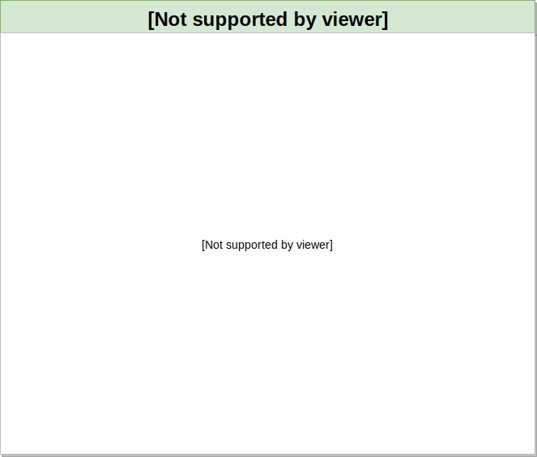

# January - using markdown
|Monday|Tuesday|Wednesday|Thursdat|Friday|
|---|---|---|---|---|
|   |1 New Year| 2  | 3  | 4  |
| 7 | 8 | 9 | 10 - 0.6 Release  | 11 Release Alignment & Kickoff |
| 14 | 15 | 16 | 17 | 18 |
| 21 | 22 | 23 | 24 | 25 |
| 28 | 29 | 30 | 31 |   |

# January - using draw.io

